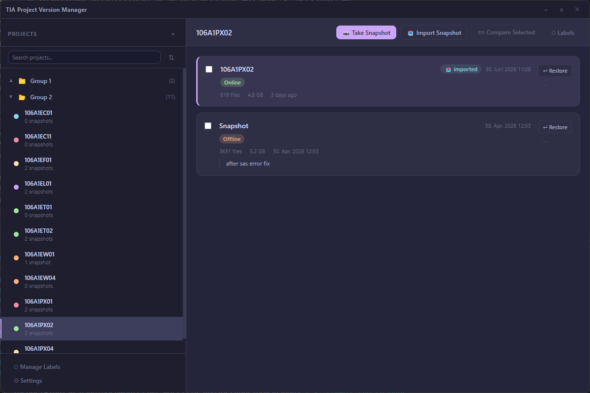

# TIA Project Version Manager

A lightweight, portable, and lightning-fast Electron desktop application designed for PLC developers to manage, snapshot, and semantically compare Siemens TIA Portal projects.

This tool runs entirely local (no runtime npm dependencies, Node.js built-ins only) and bridges JavaScript/web technology with the Siemens TIA Portal Openness C# API to automate headless code exports and precise XML logic diffs.

---




## Key Features

* **Project Snapshots & Backups:** 
  * Take complete snapshot copies of active TIA Portal project folders with custom labels, notes, and color-coded tags.
  * Automatic fallback backup creation before restoring older project baselines.
* **Obsidian-Style Tree View:**
  * Organize TIA projects into nested folder hierarchies (e.g. `Area 1/Line A/Cell 3`) using the `group` property.
  * Real-time fuzzy filtering/search (auto-expands matching paths) and sorting by alphabetical order, snapshots count, or date added.
  * Dynamic sidebar width resizing with saved user preferences.
  * Native `<datalist>` dropdown suggestions for existing groups when registering or editing projects.
* **Headless PLC Block Exporter (TIA Openness):**
  * Spawns a lightweight C# CLI shim to compile and export all PLC blocks (OBs, FCs, FBs, DBs) into SimaticML XML files, operating fully headless in the background.
* **Semantic Logic Diffing:**
  * Custom Myers-diff engine comparison of exported PLC block code.
  * Discards volatile metadata (such as editor UIds, timestamps, and product versions) to focus strictly on block interfaces and code networks (e.g., SCL code).
  * Robust safety guards (`MAX_DIFF_LINES` limits and trace memory budget) to prevent heap-out-of-memory crashes on massive FBD/LAD block diagrams.
* **SIMATIC Automation Compare Tool (SACT) Integration:**
  * Open individual PLC blocks side-by-side inside the official Siemens SACT comparison tool with a single click.

---

## Architecture

The project is structured into three main layers:
1. **Electron Main Process (`src/main/`):** Handles filesystem operations, data storage via a flat JSON file, spawning the C# Openness shim, and coordinating IPC channels.
2. **C# Openness Shim (`src/shims/TiaExporter/`):** Compiled CLI wrapper that communicates directly with `Siemens.Engineering.dll` via reflection to load whichever TIA Portal version is installed (V14–V20+) and export compiled PLC blocks.
3. **Renderer Process (`src/renderer/`):** Vanilla JS ES-modules client styling featuring custom CSS variables, a custom modal overlay framework, and in-memory caching for comparison result sets.

---

## Prerequisites

To run this application and successfully export/diff blocks, your machine must meet the following:
* **Operating System:** Windows (10 or 11).
* **TIA Portal:** TIA Portal installation (V14 up to V20+) with the **TIA Portal Openness** feature checked during installation.
* **User Permissions:** Your Windows user must be added to the local **"Siemens TIA Openness"** user group. Log out and log back in after adding your user for permissions to take effect.
* **Shim Compiler:** .NET SDK (v6.0 or later) if you intend to compile the C# exporter from source.

---

## Installation & Setup

1. **Clone the repository:**
   ```bash
   git clone https://github.com/your-username/tia-project-version-manager.git
   cd tia-project-version-manager
   ```

2. **Install Node.js dependencies (development only):**
   ```bash
   npm install
   ```

3. **Build the C# Exporter Shim:**
   Ensure .NET SDK is installed and run the compilation script:
   ```bash
   npm run build-shim
   ```
   This compiles `TiaExporter.csproj` in Release mode and copies `TiaExporter.exe` into `src/shims/TiaExporter/`.

4. **Launch the application:**
   ```bash
   npm start
   ```

---

## Usage Guide

### 1. Initial Configuration
When launching for the first time:
* Click **Open Settings** (or the Gear icon at the bottom of the sidebar) and configure a **Working Directory**.
* The **Working Directory** should be the folder where your active TIA Portal projects live. The app will create a hidden `_snapshots/` folder inside this directory to store version archives.
* *(Optional)* Set the path to your `Siemens.Automation.Compare.Frame.exe` (SIMATIC Automation Compare Tool) in settings to enable side-by-side block compares.

### 2. Registering a Project
* Click the **`+`** button in the sidebar.
* Pick a TIA Portal project file (`.ap14`, `.ap15`, etc.).
* Optionally specify a group path using slashes to structure the project inside folders (e.g., `Factory A/Line 1`).

### 3. Version Controls & Diffing
* Select a project, then click **Take Snapshot** in the toolbar to save a labeled record.
* To compare two versions, select the checkbox next to both snapshots in the version list and click **Compare Selected** in the toolbar.
* Under the comparison view, select **Generate Semantic Diff**. This triggers the headless Openness export (takes 1–2 minutes on first run). Once generated, browse the modified blocks on the left tree to inspect inline diffs.

---

## File Ignore Setup (.gitignore)

The following files are configured to be excluded from Git commits:
* `node_modules/` — Node.js packages
* `dist/` & `build/` — Electron production installers
* `src/shims/TiaExporter/bin/` & `src/shims/TiaExporter/obj/` — C# compilation artifacts
* Local developer environments (`.vs/`, `.vscode/`, `.idea/`, `*.user`)

---

## License

Distributed under the MIT License. See `LICENSE` for details.
